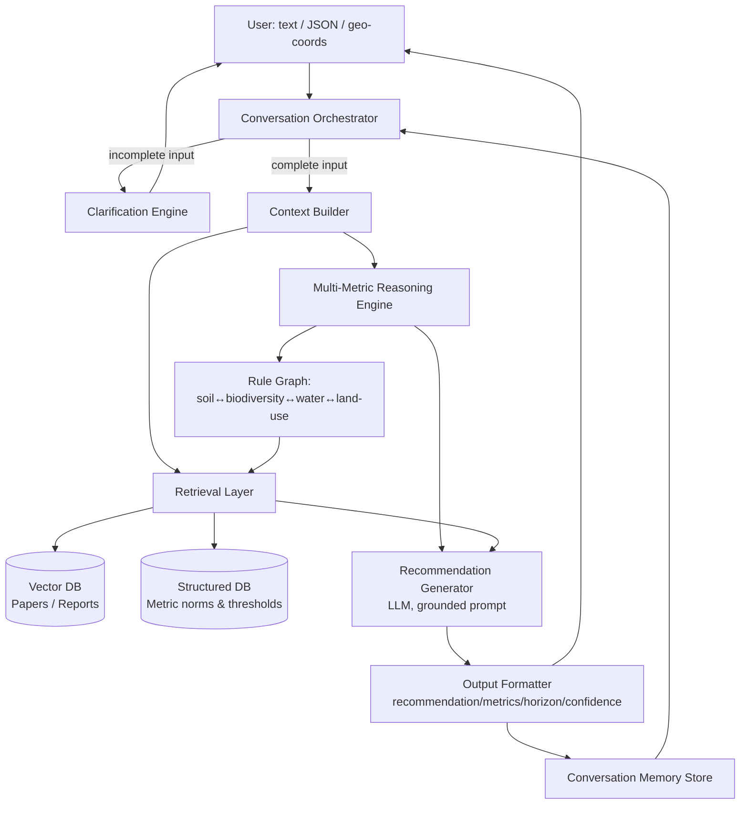

# Darukaa.Earth — AI Biodiversity Intelligence System
## System Architecture & Design Document

---

## 1. Design Philosophy

The brief explicitly penalizes "generic LLM-only" answers. That means the LLM's job is **synthesis and dialogue**, never the source of environmental facts or numeric claims. Every quantitative claim in a response must trace back to a retrieved document or a rule in the reasoning engine — not to model memory.

The system is built as three separable layers:

1. **Knowledge Layer** — structured facts + retrievable literature (grounding)
2. **Reasoning Layer** — deterministic multi-metric inference (the "scientist")
3. **Conversation Layer** — LLM orchestration, memory, clarification (the "interface")

This separation is also the fastest way to win on the judging rubric: reasoning (30%) and grounding (25%) live in layers 1–2, which are testable independently of the chatbot — you can demo them with a script before the UI exists.

---

## 2. High-Level Architecture



**Why this shape:** the Reasoning Engine sits *before* the LLM call, not inside it. It decides *which* causal chains apply (e.g., "low SOC + monoculture + semi-arid → trigger agroforestry + soil-microbe branch") using explicit rules over the input metrics. The LLM only turns already-selected, already-cited evidence into prose. This is what separates "AI environmental scientist" from "chatbot with a system prompt."

---

## 3. Knowledge Layer

### 3.1 Two knowledge stores, not one

A single vector DB is not enough — you need both **unstructured evidence** (why something works) and **structured norms** (what counts as "low" or "healthy"). Conflating them is why most hackathon RAG bots produce vague answers.

| Store | Contents | Tech | Purpose |
|---|---|---|---|
| **Vector DB** | Chunked FAO/IPCC/IUCN/peer-reviewed papers, agroforestry & regenerative-ag studies, soil science reports | FAISS (you already have this pipeline) + sentence-transformer embeddings (e.g. `bge-small-en` or `all-MiniLM-L6-v2` for speed) | Retrieve the *evidence sentence* to cite per recommendation |
| **Structured DB** | Reference thresholds/norms per biome: healthy SOC % ranges, rainfall bands, species-richness baselines by land-use type, degradation indicators | SQLite/Postgres, simple JSON tables acceptable for hackathon scope | Ground the *diagnosis* — is 0.3% SOC actually low for semi-arid cropland? |

### 3.2 Structured schema (example)

```json
{
  "metric": "soil_organic_carbon_pct",
  "biome": "semi-arid_cropland",
  "healthy_range": [1.0, 2.5],
  "degraded_below": 0.5,
  "unit": "%",
  "source": "FAO Global Soil Partnership, Soil Organic Carbon Mapping (2020)"
}
```

Build ~5–8 of these per metric category (soil pH, SOC, moisture, land-use type, rainfall band, species richness baseline, pollution index, deforestation rate) across 3–4 biome types (semi-arid, tropical, temperate, arid). This alone lets the system say "0.3% is critically low for semi-arid cropland" instead of guessing — that single sentence is worth real judging points because it's a *grounded diagnosis*, not a recommendation yet.

### 3.3 RAG chunking strategy

- Chunk papers by **claim**, not by page — target 150–300 tokens per chunk, so each retrieved chunk is close to a single citable fact (e.g. "cover cropping increases SOC by 15–25% over 2–3 years").
- Store metadata per chunk: `{source, year, metric_affected: [...], practice: [...], biome_applicability: [...]}`. This metadata is what lets you *filter* retrieval by the metrics actually in the user's input, rather than doing pure semantic search — semantic search alone will surface plausible-sounding but wrong-biome evidence.
- Retrieval flow: (1) filter chunks by `metric_affected` overlapping the deficient metrics identified by the Reasoning Engine, (2) rank the filtered set by embedding similarity to the query, (3) take top-k (3–5) as citations.

### 3.4 Seed corpus (small but real, for a few-hours build)

Don't try to index thousands of papers. Pick ~15–20 real, citable sources and hand-chunk them:
- FAO: Soil Organic Carbon reports, agroforestry guidelines
- IPCC: AR6 WG2 chapters on land degradation/ecosystems
- IUCN: habitat fragmentation / species richness studies
- A handful of specific agroforestry/intercropping meta-analyses (Web of Science / Google Scholar — pick ones with concrete % figures)

Quality over quantity is legible to judges: 20 well-chunked, correctly-cited sources beat 500 poorly indexed ones, because every demo answer will visibly cite real, checkable numbers.

---

## 4. Multi-Metric Reasoning Engine (the core differentiator)

This is a **rule graph**, not a single LLM prompt. Represent causal relationships explicitly so answers combine variables instead of answering on one axis.

### 4.1 Rule graph structure

```json
{
  "trigger": {
    "soil_organic_carbon_pct": {"op": "<", "value": 0.5},
    "land_use": {"op": "==", "value": "monoculture"},
    "rainfall": {"op": "==", "value": "low"}
  },
  "diagnosis": "Low SOC + monoculture under water stress compounds habitat simplification and erosion risk",
  "candidate_interventions": ["agroforestry_intercropping", "legume_cover_crop"],
  "cross_metric_effects": {
    "agroforestry_intercropping": {
      "soil_organic_carbon_pct": "+15-25% over 2-3y",
      "species_richness_index": "+ (canopy niches, pollinator corridors)",
      "water_retention": "+ (root structure reduces runoff)",
      "microclimate_temperature": "- 1-3°C canopy cooling"
    }
  }
}
```

Each node in the graph encodes exactly the kind of chain the brief asks for: **soil ↔ biodiversity**, **water ↔ species survival**, **land-use ↔ fragmentation**. Build 8–12 of these nodes covering the main degradation patterns (low SOC + monoculture, low rainfall + row-crop, high pollution index + water body proximity, fragmented land use + low species richness, etc.) — that's enough breadth for a hackathon demo to look genuinely systemic rather than single-path.

### 4.2 Why deterministic rules, not "ask the LLM to reason across metrics"

Judges are explicitly told to check for "non-single-variable answers." An LLM prompted with all metrics at once *will* sometimes silently ignore one. A rule graph guarantees multi-metric combination is structural, not probabilistic — and it's trivial to demo by showing the JSON trigger firing on multiple conditions simultaneously.

### 4.3 Confidence scoring

Attach confidence per recommendation from three signals: (a) number of independent retrieved sources agreeing, (b) recency of source, (c) whether biome-specific data was available or a general fallback was used. Simple weighted score → High/Medium/Low. This satisfies the "confidence level" output field cheaply and defensibly.

---

## 5. Conversational Intelligence Layer

### 5.1 Slot-filling, not open-ended chat

Model the conversation as slot-filling over a required-metrics schema, not free-form chat with a system prompt. Required slots for a diagnosis: `soil_organic_carbon_pct | soil_ph | land_use | rainfall_pattern | region_biome` (minimum 3 populated per the constraint). Any request against an incomplete slot set routes to the Clarification Engine rather than to the Reasoning Engine.

```
if len(filled_slots) < 3:
    ask_for(missing_slots, prioritized_by_impact)
else:
    proceed_to_reasoning_engine(filled_slots)
```

Prioritize which missing slot to ask for first by which one gates the most rule-graph nodes — e.g., `land_use` and `rainfall_pattern` unlock more diagnostic branches than `soil_ph` alone, so ask for those first.

### 5.2 Memory

Two memory tiers, both cheap to build:
- **Session slot memory**: the filled-metrics dict, persists across turns, updated incrementally as the user answers.
- **Conversation history buffer**: last N turns, fed to the LLM only for tone/context continuity (e.g. "earlier you mentioned pollinator decline — that connects to the SOC issue we discussed").

Don't over-engineer this — a dict in session state plus a rolling message list is sufficient for the demo; a vector-based long-term memory is unnecessary scope for a few-hour build.

### 5.3 Context adaptation example

```
User: "Biodiversity is declining on my land"
System: [0/5 slots filled] → "Can you share soil organic carbon %, 
         rainfall pattern, and land use type? These three tell me 
         the most about what's driving the decline."
User: "SOC is 0.3%, rainfall is low, we grow wheat as monoculture"
System: [3/5 slots filled, region_biome missing] → runs Reasoning 
         Engine with an inferred biome guess flagged as lower-confidence,
         OR asks one more clarifying question if biome materially 
         changes which rule nodes fire.
```

---

## 6. Input Handling

- **Text**: parsed via a lightweight extraction step (regex + small LLM extraction prompt) into the slot schema before hitting the Reasoning Engine — never reason directly over raw text.
- **Structured JSON**: validated against a pydantic schema (natural fit for your FastAPI background) — reject/flag out-of-range values (e.g. pH of 25) rather than passing them through.
- **Geo-coordinates (bonus)**: reverse-geocode to biome/climate zone (a static lookup table of lat/lon bounding boxes → biome is enough for a hackathon; no need for a live GIS service) to auto-fill `region_biome` and cross-check user-stated rainfall against regional climate norms.

```python
class EnvironmentalInput(BaseModel):
    soil_organic_carbon_pct: float | None = None
    soil_ph: float | None = None
    soil_moisture_pct: float | None = None
    land_use: str | None = None
    rainfall_pattern: str | None = None
    region_biome: str | None = None
    lat: float | None = None
    lon: float | None = None
    pollution_index: float | None = None
    deforestation_rate: float | None = None
```

---

## 7. Output Contract

Every response is generated by filling this schema, then the LLM renders it as prose — never the reverse:

```json
{
  "recommendation": "Introduce agroforestry-based intercropping (e.g. leguminous trees with wheat rows)",
  "reasoning": "Root systems and leaf litter increase soil organic carbon accumulation; canopy diversity creates pollinator and bird habitat niches absent in monoculture wheat",
  "impacted_metrics": [
    {"metric": "soil_organic_carbon_pct", "expected_change": "+15-25% over 2-3 years"},
    {"metric": "species_richness_index", "expected_change": "increase, pollinator/bird niches"},
    {"metric": "water_retention", "expected_change": "improved, reduced runoff"}
  ],
  "time_horizon": "medium-term (2-3 years for measurable SOC change; habitat effects visible within 1 season)",
  "confidence": "High (3 independent sources, biome-matched data available)",
  "sources": [
    "FAO (2021), Agroforestry Practices and Soil Carbon Sequestration",
    "IPCC AR6 WG2, Ch.5 — Land Degradation and Ecosystem Services"
  ]
}
```

This maps directly onto the "Output Quality" rubric line item and makes the demo trivially inspectable — you can literally show this JSON before showing the chat UI.

---

## 8. Suggested Tech Stack (fits your existing stack, buildable in hours)

| Component | Choice | Why |
|---|---|---|
| Embeddings + Vector DB | FAISS + `sentence-transformers` | You already run this for the semantic-cache project — reuse the pipeline |
| Structured DB | SQLite | Zero setup, sufficient for hackathon scope |
| API layer | FastAPI | Matches your existing tooling |
| Reasoning Engine | Plain Python rule graph (list of dict rules, no framework needed) | Deterministic, demoable, fast to write |
| LLM | Any hosted API (Claude/GPT) for extraction + final prose generation only | Never used for facts/numbers |
| Frontend | Minimal Next.js chat UI (reuse your dashboard patterns) or skip entirely and demo via API/CLI | The brief explicitly says they're not judging UI polish |

---

## 9. UI/UX Design

The rubric doesn't score UI, but with a full day, a well-designed interface makes the reasoning depth *visible* — which indirectly boosts scores on "Output Clarity" and makes judges trust the "Depth of Reasoning" claims because they can see the chain, not just read a paragraph. Design principle: **the UI is a window into the reasoning engine, not a decoration on top of it.**

### 9.1 Layout — three-panel, not a single chat box

```
┌─────────────┬──────────────────────────┬─────────────────┐
│  Input /    │      Conversation        │   Evidence &     │
│  Metrics    │      (chat thread)       │   Reasoning      │
│  Panel      │                          │   Panel          │
│             │                          │                  │
│ Slot status │  User + system messages  │  Live-updating:  │
│ checklist   │  Recommendation cards    │  - cited sources │
│ (filled/    │  rendered inline, not    │  - rule-graph    │
│ missing)    │  plain text              │    node that     │
│             │                          │    fired         │
│ JSON/text   │                          │  - confidence    │
│ toggle      │                          │    breakdown     │
│             │                          │                  │
│ Geo picker  │                          │                  │
│ (optional)  │                          │                  │
└─────────────┴──────────────────────────┴─────────────────┘
```

This layout directly demos the three architecture layers side by side — input/slots (Conversation Layer's state), chat (LLM synthesis), evidence (Knowledge + Reasoning layers) — so a judge watching the demo sees grounding happen in real time instead of taking your word for it.

### 9.2 Recommendation card component (renders inside chat, not as plain prose)

Each recommendation from the Output Contract (Section 7) renders as a structured card:

- Header: recommendation title + confidence badge (High/Medium/Low, color-coded)
- Body: reasoning (short paragraph)
- Metric chips: one small pill per impacted metric with the expected change (e.g. `SOC +15-25%` `Species richness ↑` `Water retention ↑`), color-coded green/amber by direction
- Footer: time-horizon tag (short/medium/long, icon-coded) + expandable "Sources" row showing the actual citations retrieved for this specific answer

Building this as one reusable React/Next.js component that consumes your Output Contract JSON directly means the UI never drifts from the underlying reasoning — a common hackathon failure mode is a nice UI that quietly renders hardcoded or stale content.

### 9.3 Evidence panel — the highest-leverage UI element for judging

A live side panel that, whenever a recommendation card appears, shows: the retrieved source chunk (the actual sentence used, not the whole paper), its origin (FAO/IPCC/etc.), and which rule-graph node triggered. This single panel is what proves "not a generic LLM" to a judge in under 10 seconds of looking at the screen — it's worth building even before chat polish.

### 9.4 Multi-metric visualization (optional but high-impact)

A small radar or bar chart comparing the user's input metrics against the healthy-range bands from the Structured DB (Section 3.2) — visually showing *which* metrics are degraded and by how much, before any recommendation is given. This directly visualizes the "multi-metric reasoning" requirement rather than just asserting it in text.

### 9.5 Tech choices for the UI (reuses your existing stack)

- Next.js + Tailwind, same pattern as your metrics-dashboard work
- Recharts for the radar/bar visualization
- Server-sent events or simple polling for the "live-updating" evidence panel feel during a response (skip real streaming infra — not worth the time cost on a 1-day build)

---

## 10. Exceeding the Rubric (targeting 100%+)

Everything in Sections 1–8 covers the stated requirements. These are additions that go beyond what's asked, chosen because each maps to a specific rubric line rather than being generic polish:

| Addition | Rubric line it strengthens | Effort |
|---|---|---|
| **Trade-off flagging**: recommendations note secondary costs (e.g. "agroforestry reduces short-term wheat yield ~10-15% in year 1") | Depth of Reasoning — most hackathon bots only show upside | Low — one extra field per rule-graph node |
| **Counterfactual / "why not X"**: system explains why a plausible-but-wrong intervention was *not* recommended (e.g. "irrigation was considered but doesn't address the underlying SOC deficit") | Depth of Reasoning, Scientific Grounding | Low — reuse rule-graph candidate list, just surface the rejected candidates with one line each |
| **Cross-source agreement scoring**: confidence explicitly shows *which* sources agree vs. conflict, not just a single number | Scientific Grounding | Low — you already retrieve multiple chunks per claim |
| **Geo-coordinate biome auto-detection** (bonus in brief, made real) | Input Handling bonus | Medium — static lat/lon → biome lookup table, ~20 regions is enough |
| **Downloadable report** (PDF/markdown export of the full reasoning chain for one session) | Output Clarity | Low — you already have the structured JSON; render to a doc |
| **"Explain this metric" drill-down**: clicking any metric chip shows the structured-DB definition and healthy-range source | Knowledge System Design | Low — surfaces the Structured DB you already built |
| **Regression test set**: 5–8 known input scenarios with expected diagnosis directions, run automatically, shown as a small "verified against N scenarios" badge | Scientific Grounding, credibility signal to judges | Medium — write once, reuse for demo confidence |

None of these require new architecture — they're all thin surfacing of data the core system (Sections 1–8) already produces. That's the fastest path to exceeding the rubric without inventing new subsystems under time pressure.

---

## 11. Revised Build Schedule — 1 Day

| Block | Time | Work |
|---|---|---|
| 1 | 0:00–1:30 | Structured DB (metric norms/thresholds) + hand-chunk 15–20 sources into FAISS |
| 2 | 1:30–2:30 | Pydantic input schema, slot-filling logic, clarification routing |
| 3 | 2:30–4:30 | Rule graph: 10–14 nodes covering cross-metric patterns, incl. trade-off + counterfactual fields |
| 4 | 4:30–5:30 | Output formatter (Output Contract) + confidence scoring incl. cross-source agreement |
| 5 | 5:30–6:30 | Thin FastAPI orchestration wiring 1–4 together; test via script/Postman before touching UI |
| 6 | 6:30–8:30 | Next.js three-panel UI: chat thread + recommendation card component + evidence panel |
| 7 | 8:30–9:30 | Metric radar chart + geo-coordinate biome lookup |
| 8 | 9:30–10:30 | Regression test set (5–8 scenarios) + downloadable report export |
| 9 | 10:30–end | Buffer: bug fixes, demo script, README with architecture diagram from Section 2 |

Block 5's checkpoint matters most: don't start UI work until the API returns a correct Output Contract JSON for at least 2–3 manually tested scenarios. Building UI against a half-working backend is the most common way a 1-day build runs out of time.
